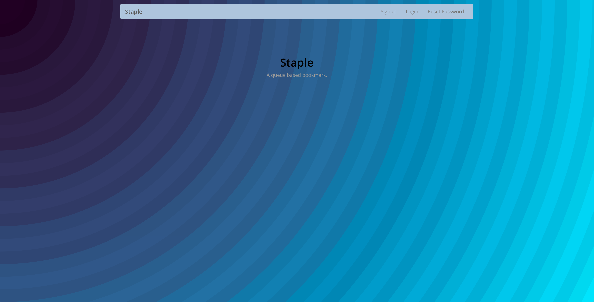
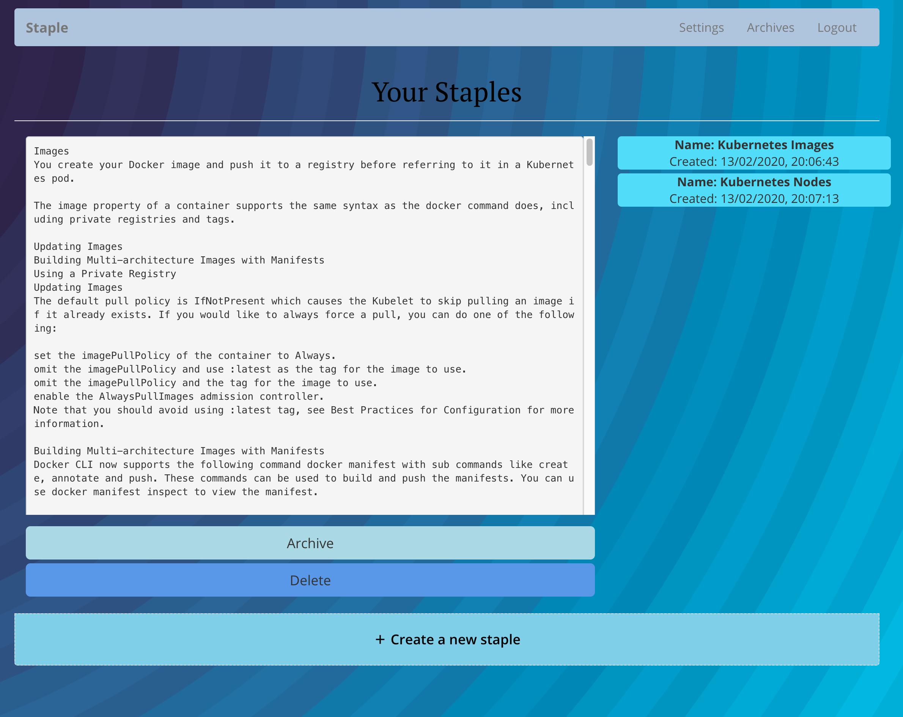
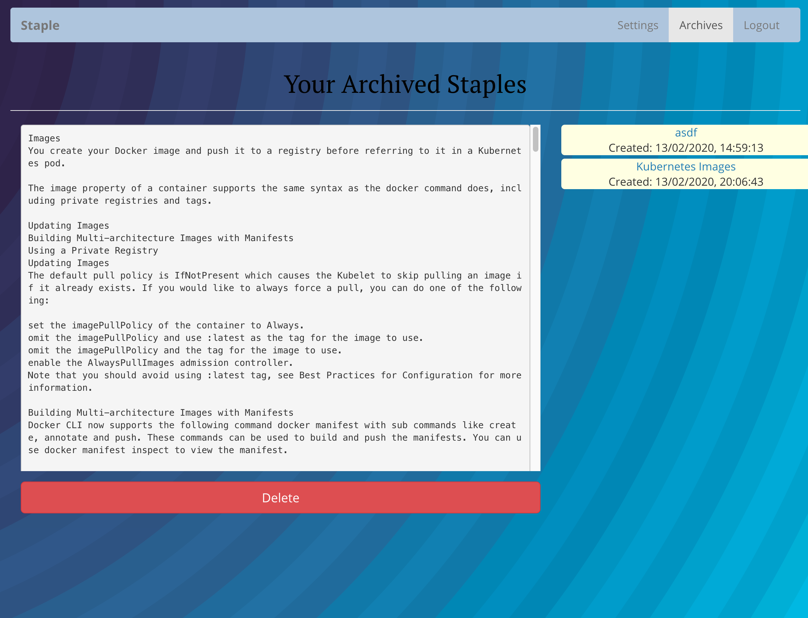
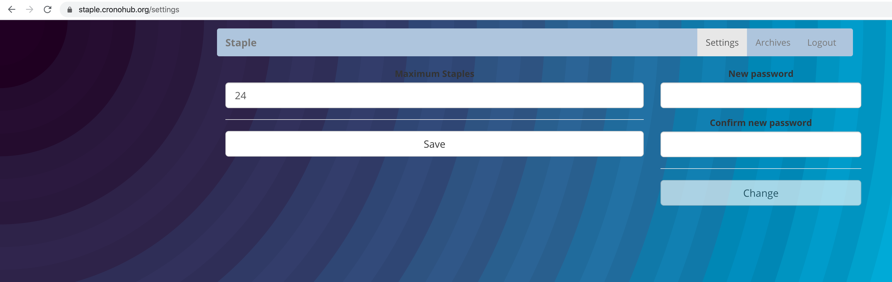

[](https://circleci.com/gh/staple-org/staple)
[](https://codecov.io/gh/staple-org/staple)

# Staple

The backend of Staple. This REST api allows for creation and management of staples.

# What are staples

Staples are chronologically ordered bookmarks which you wish to read later. Staple differs from other Read Later
app in that it doesn't allow more then a configured number of read later entries and one twist...

You can only read your entries in the order when you created them. This restriction is aiming to make it easier
to catch up on things that you wish to read later. Because you can only read in a FIFO (first in first out) manner
you are forced to go through your list in the priority in which you created it.

This will make it easier to actually read the things you wanted to read and not have things laying around somehwere
for eternity... unread. Never to be known.

Staples also provides a frontend written with React located here: [Staple Frontend](https://github.com/staple-org/frontend).

But it's totally okay to use staple through the API only.

# The frontend

The main front



The main with a couple of staples



The lists are only viewed in FIFO order. After archiving though, they can be viewed in any order.



And a couple of settings and the option to change your password...



# Testing localhost https

```bash
mkcert -key-file key.pem -cert-file cert.pem localhost
```

# Deploying

All settings are through command line options. These options are defined through vault or
kubernetes secret storage. Find the infrastructure deployment scripts under [Infrastructre Repository](https://github.com/staple-org/infrastructure).

# Local Development

In order to work on the frontend and not having to constantly build static components, an option is provided
under the name REACT_APP_DEV_HOST. This, if set to something like `http://localhost:9998` (where normally the
backend would run in a local environment) and starting the backend in dev mode with `--dev` will result in a
de-coupled development experience.

# Production

In order to build production assets for the frontend run:

```
make static_assets
make
```

Then build a docker image with:

```
make image="staple-org/staple" version=`git describe --exact-match --tags $(git log -n1 --pretty='%h')` docker_image
```

...and continue with deployment the container with Kubernetes. The `image` and `version` variables are provided
for convenience to define your own docker image.

# API

If you are not a fan of using a web-site you have the option to use the API with postman or another front which can
store tokens and send requests. For example to log in, request a token with:

```
curl -X POST -H 'content-type: application/json' -d'{"email": "your@email.com", "password": "test"}' https://staple.cronohub.org/rest/api/1/get-token
```

You should get back something like this:

```
{"token":"JWT-TOKEN"}
```

Then you can use this token in consecutive requests to list staples archive, delete or things like that:

```
curl -X GET -H 'Authorization: Bearer TOKEN' https://staple.cronohub.org/rest/api/1/staple/next
```

Should get you something like:

```
{"staple":{"name":"Kubernetes Nodes","id":11,"content":"CONTENT","created_at":"2020-02-13T19:07:13.982385Z","archived":false}}
```
